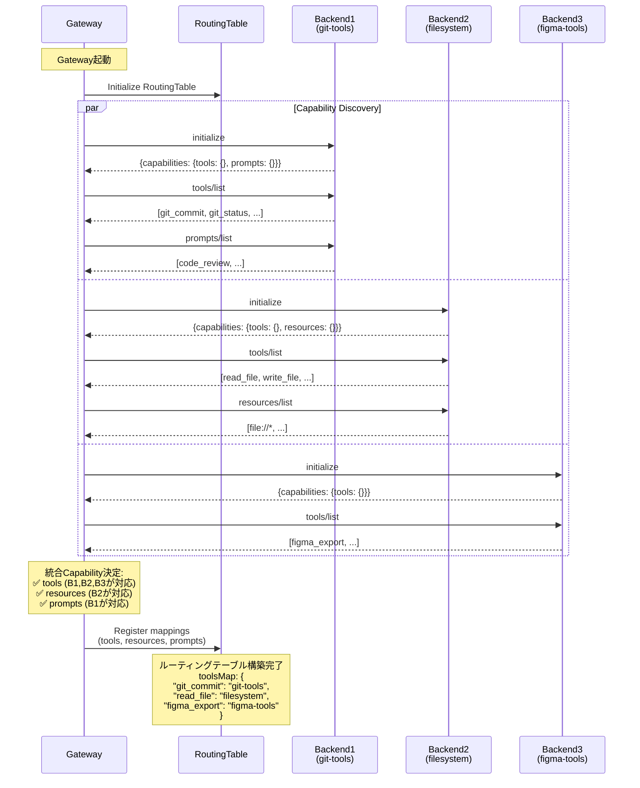
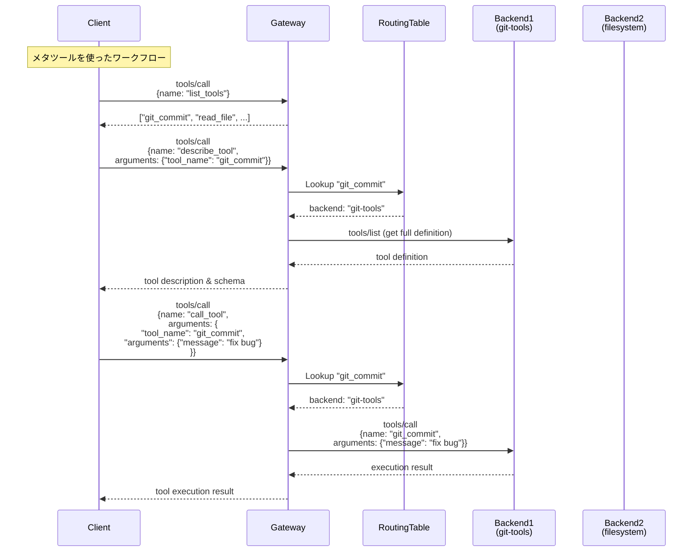
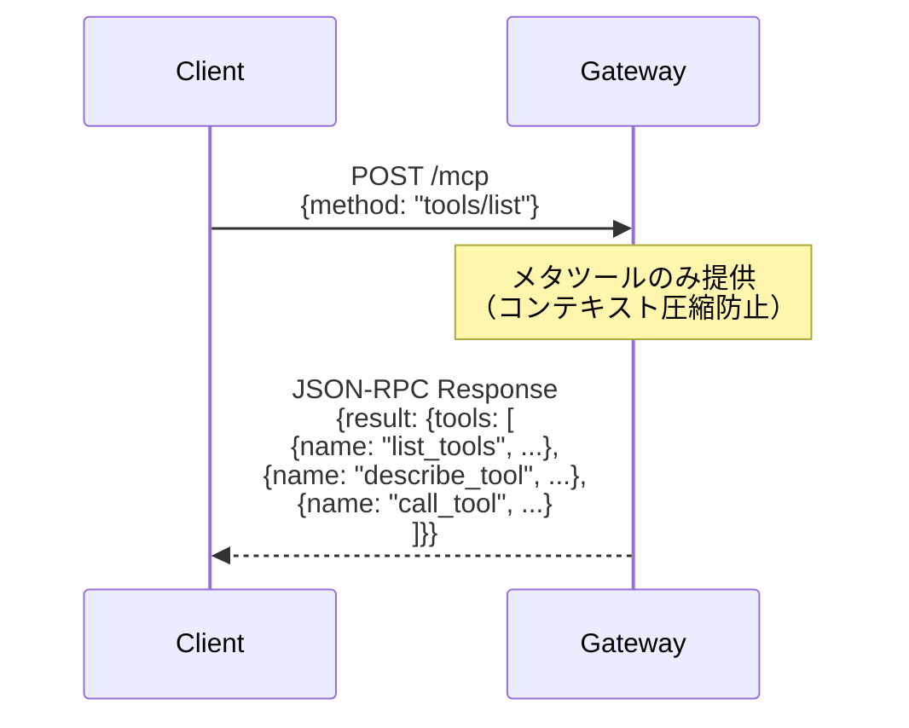

# MCP Server Gateway Specification

## 概要

MCP Server Gatewayは、複数のMCPサーバーへの統一されたアクセスポイントを提供する機能です。単一の `/mcp` エンドポイントを通じて、異なるバックエンドMCPサーバーが提供するツール、リソース、プロンプトに透過的にアクセスできるようにします。

## 背景

現在のawesome-mcp-proxyは、個別のMCPサーバーへのプロキシとして動作していますが、複数のMCPサーバーを統合して単一のエンドポイントから利用できる機能が必要です。これにより、クライアントは複数のバックエンドサーバーの存在を意識することなく、すべての機能にアクセスできるようになります。

## 機能要件

### 1. 統一エンドポイント
- **単一のエンドポイント**: `/mcp` を通じてすべてのバックエンドMCPサーバーにアクセス
- **透過的なルーティング**: クライアントはバックエンドサーバーの存在を意識しない
- **自動的な振り分け**: リクエスト内容に基づいて適切なバックエンドサーバーを自動選択

### 2. バックエンド管理
- **複数のトランスポート方式をサポート**:
  - HTTP/HTTPS
  - stdio (標準入出力)
  - WebSocket（将来的な拡張）
- **動的なバックエンド登録**: 設定ファイルベースでのバックエンド管理
- **ヘルスチェック**: バックエンドサーバーの可用性監視

### 3. 能力ディスカバリー
- **起動時の能力取得**: 各バックエンドサーバーの提供する機能を自動的に取得
  - ツール一覧 (`tools/list`)
  - リソース一覧 (`resources/list`)
  - プロンプト一覧 (`prompts/list`)
- **定期的な更新**: バックエンドの能力を定期的に再取得
- **統合ルーティングテーブル**: すべてのバックエンドの能力を統合管理

### 4. リクエストルーティング
- **メソッドベースのルーティング**:
  - `tools/call`: ツール名に基づいてバックエンドを選択
  - `resources/read`: URIパターンに基づいてバックエンドを選択
  - `prompts/get`: プロンプト名に基づいてバックエンドを選択
- **リスト系メソッドの集約**:
  - `tools/list`: 全バックエンドのツールを集約して返却
  - `resources/list`: 全バックエンドのリソースを集約して返却
  - `prompts/list`: 全バックエンドのプロンプトを集約して返却

### 5. エラーハンドリング
- **バックエンドエラーの処理**: 個別バックエンドの障害を適切に処理
- **フォールバック機構**: 可能な場合は代替バックエンドへのフォールバック
- **詳細なエラーレポート**: クライアントへの適切なエラー情報の提供

## 必須機能の仕様

### 動的Capability検出

MCP Server Gatewayは、**起動時に全バックエンドの能力を検出し、動的にcapabilityを決定**します。

#### Capability集約ルール

**すべてのcapabilityが動的に決定**されます：

1. **tools capability**: 
   - **1つでもバックエンドがサポートしていれば有効化**
   - サポートするバックエンドがない場合は省略

2. **resources capability**:
   - **1つでもバックエンドがサポートしていれば有効化**
   - サポートするバックエンドがない場合は省略

3. **prompts capability**:
   - **1つでもバックエンドがサポートしていれば有効化**
   - サポートするバックエンドがない場合は省略

#### 動的検出のアルゴリズム

```go
// Gateway起動時のcapability集約
func (g *Gateway) discoverCapabilities() GatewayCapabilities {
    capabilities := GatewayCapabilities{
        // すべて動的検出: バックエンドがサポートしていれば有効化
    }
    
    for _, group := range g.groups {
        for _, backend := range group.Backends {
            // 各バックエンドにinitializeを送信
            initResp, err := backend.Initialize()
            if err != nil {
                log.Printf("Backend %s initialization failed: %v", backend.Name, err)
                continue
            }
            
            // 返されたcapabilityを統合
            if initResp.Capabilities.Tools != nil {
                capabilities.Tools = true
            }
            if initResp.Capabilities.Resources != nil {
                capabilities.Resources = true
            }
            if initResp.Capabilities.Prompts != nil {
                capabilities.Prompts = true
            }
        }
    }
    
    return capabilities
}
```

#### initializeレスポンス例

```json
{
  "jsonrpc": "2.0",
  "id": 1,
  "result": {
    "protocolVersion": "2024-11-05",
    "capabilities": {
      "tools": {},     // バックエンドが1つでもサポートしていれば有効
      "resources": {}, // バックエンドが1つでもサポートしていれば有効  
      "prompts": {}    // バックエンドが1つでもサポートしていれば有効
    },
    "serverInfo": {
      "name": "mcp-gateway",
      "version": "1.0.0"
    }
  }
}
```

#### 動的メソッド

**必須メソッド**（常に実装）:
- `initialize` - 初期化と動的capability宣言

**動的メソッド**（バックエンドの能力に応じて有効化）:
- `tools/list`, `tools/call` - 1つでもバックエンドがtoolsをサポートする場合
- `resources/list`, `resources/read` - 1つでもバックエンドがresourcesをサポートする場合  
- `prompts/list`, `prompts/get` - 1つでもバックエンドがpromptsをサポートする場合

### メタツール仕様

Gatewayは**コンテキスト圧縮を防ぐため**、tools capabilityが有効な場合に以下の3つのメタツールのみを提供します：

#### 1. `list_tools` ツール
- **目的**: バックエンドから利用可能なツールの名前一覧を取得
- **引数**: なし
- **戻り値**: ツール名の配列 `["tool1", "tool2", ...]`

#### 2. `describe_tool` ツール  
- **目的**: 指定したツールの詳細情報（説明、引数仕様）を取得
- **引数**: 
  - `tool_name` (string, required): 詳細を取得したいツール名
- **戻り値**: ツールの完全な定義情報（description、inputSchema等）

#### 3. `call_tool` ツール
- **目的**: 実際のツール実行を行う
- **引数**:
  - `tool_name` (string, required): 実行するツール名
  - `arguments` (object, required): ツールに渡す引数（JSON形式）
- **戻り値**: ツール実行結果

#### メタツールによる実行フロー

```
1. list_tools → ツール名一覧を取得
2. describe_tool → 特定ツールの詳細取得
3. call_tool → 実際のツール実行
```

この設計により、クライアントは必要な時に必要な情報のみを取得でき、MCPセッションのコンテキストサイズを最適化できます。

#### メタツール実装例

```json
// tools/list のレスポンス（メタツールのみ）
{
  "jsonrpc": "2.0",
  "id": 1,
  "result": {
    "tools": [
      {
        "name": "list_tools",
        "description": "バックエンドから利用可能なツール名一覧を取得",
        "inputSchema": {
          "type": "object",
          "properties": {},
          "required": []
        }
      },
      {
        "name": "describe_tool", 
        "description": "指定したツールの詳細情報を取得",
        "inputSchema": {
          "type": "object",
          "properties": {
            "tool_name": {
              "type": "string",
              "description": "詳細を取得したいツール名"
            }
          },
          "required": ["tool_name"]
        }
      },
      {
        "name": "call_tool",
        "description": "実際のツール実行を行う", 
        "inputSchema": {
          "type": "object",
          "properties": {
            "tool_name": {
              "type": "string",
              "description": "実行するツール名"
            },
            "arguments": {
              "type": "object",
              "description": "ツールに渡す引数（JSON形式）"
            }
          },
          "required": ["tool_name", "arguments"]
        }
      }
    ]
  }
}
```

### バックエンド不在時の挙動

バックエンドが一つも利用できない場合、Gatewayは以下の応答を返します：

1. **`initialize`**: capability無しの正常なレスポンス `{"capabilities": {}}`
2. **すべてのメソッド**: `{"error": {"code": -32601, "message": "Method not found"}}`

バックエンドの能力に応じてcapabilityとメソッドが動的に決定されます。

## 技術仕様

### 設定ファイル構造

```yaml
gateway:
  host: "0.0.0.0"
  port: 8080
  endpoint: "/mcp"
  timeout: 30s

groups:
  - name: "developer"
    backends:
      git-tools:
        name: "git-tools"
        transport: "stdio"
        command: "mcp-server-git"
        args: ["--repo", "/workspace"]
        env:
          GITHUB_TOKEN: "${GITHUB_TOKEN}"
          
      filesystem-tools:
        name: "filesystem-tools"
        transport: "http"
        endpoint: "http://localhost:3001/mcp"
        headers:
          Authorization: "Bearer ${FILESYSTEM_TOKEN}"
          
      docker-tools:
        name: "docker-tools"
        transport: "stdio"
        command: "mcp-docker"
        env:
          DOCKER_HOST: "${DOCKER_HOST}"

  - name: "designer"
    backends:
      figma-tools:
        name: "figma-tools"
        transport: "http"
        endpoint: "http://figma-mcp:3002/mcp"
        headers:
          X-Figma-Token: "${FIGMA_TOKEN}"
          
      asset-management:
        name: "asset-management"
        transport: "http"
        endpoint: "http://assets-mcp:3003/mcp"
        headers:
          Authorization: "Bearer ${ASSETS_TOKEN}"

middleware:
  logging:
    enabled: true
    level: "info"
    
  cors:
    enabled: true
    allowed_origins: ["*"]
    
  caching:
    enabled: true
    ttl: 300s
```

### ルーティングテーブル構造

```go
type RoutingTable struct {
    // ツール名 -> バックエンド名のマッピング
    ToolsMap     map[string]string
    
    // リソースURIパターン -> バックエンド名のマッピング
    ResourcesMap map[string]string
    
    // プロンプト名 -> バックエンド名のマッピング
    PromptsMap   map[string]string
    
    // バックエンド名 -> Backend実装のマッピング
    Backends     map[string]Backend
}
```

### リクエストフロー

```
1. クライアントリクエスト受信 (/mcp)
2. JSON-RPCメソッド解析
3. ルーティング判定:
   - tools/call -> メタツールかチェック、call_toolなら実ツールにルーティング
   - resources/read -> ResourcesMapを参照
   - prompts/get -> PromptsMapを参照
   - list系 -> メタツール提供 or 全バックエンドから集約
4. バックエンドへのリクエスト転送
5. レスポンスの返却
```

## シーケンス図

### 1. 初期化シーケンス（起動時の能力ディスカバリー）



### 2. メタツール使用のシーケンス



### 3. ツール一覧取得のシーケンス (tools/list) - メタツール提供



## 実装計画

### Phase 1: コア機能 (Week 1-2)
- [ ] Gatewayコア実装
  - [ ] 設定ファイル読み込み
  - [ ] バックエンド管理
  - [ ] ルーティングテーブル構築
- [ ] HTTPトランスポート実装
- [ ] 基本的なリクエストルーティング
- [ ] **メタツールシステム実装**

### Phase 2: 高度な機能 (Week 3-4)
- [ ] Stdioトランスポート実装
- [ ] 能力ディスカバリー機能
- [ ] リスト系メソッドの集約
- [ ] キャッシング機構

### Phase 3: 運用機能 (Week 5)
- [ ] ヘルスチェック実装
- [ ] メトリクス収集
- [ ] ロギング強化
- [ ] エラーハンドリング改善

### Phase 4: テストと文書化 (Week 6)
- [ ] 単体テスト
- [ ] 統合テスト
- [ ] E2Eテスト
- [ ] ドキュメント作成

### 実装の優先順位

#### Phase 1（最優先）
- ✅ **メタツールシステムの完全実装**
  - `list_tools`, `describe_tool`, `call_tool` の3つのメタツール
  - `tools/list` でメタツールのみ提供
  - 実ツールは `call_tool` 経由でアクセス

#### Phase 2
- 各capabilityの機能完全実装（tools, resources, prompts）
- 集約とルーティング機構の最適化

## 成功指標

- **パフォーマンス**:
  - レイテンシ: 直接アクセスと比較して10%以内の増加
  - スループット: 100 req/s以上の処理能力
  
- **信頼性**:
  - 可用性: 99.9%以上
  - エラー率: 0.1%未満
  
- **スケーラビリティ**:
  - 10以上のバックエンドサーバーをサポート
  - 1000以上のツール/リソース/プロンプトの管理
  
- **コンテキスト効率**:
  - メタツール使用によるコンテキストサイズ削減: 80%以上

## 影響範囲

- **既存機能への影響**: 既存のプロキシ機能と並行して動作可能
- **互換性**: MCP仕様に完全準拠、メタツールによるコンテキスト最適化
- **移行パス**: 段階的な移行が可能

## リスクと対策

### リスク1: バックエンドサーバーの障害
- **対策**: ヘルスチェックと自動的な障害検出・隔離

### リスク2: パフォーマンス劣化
- **対策**: キャッシング機構とコネクションプーリング

### リスク3: セキュリティ
- **対策**: 適切な認証・認可機構の実装

### リスク4: メタツール使用の複雑さ
- **対策**: 明確なドキュメントと使用例の提供

## 参考資料

- [Model Context Protocol Specification](https://modelcontextprotocol.io/specification)
- [JSON-RPC 2.0 Specification](https://www.jsonrpc.org/specification)
- Issue #2: MCP Gateway/Proxy Configuration Management (Closed)
- Issue #8: Feature: MCP Server Gateway - Single Endpoint Proxy Implementation (Closed)
