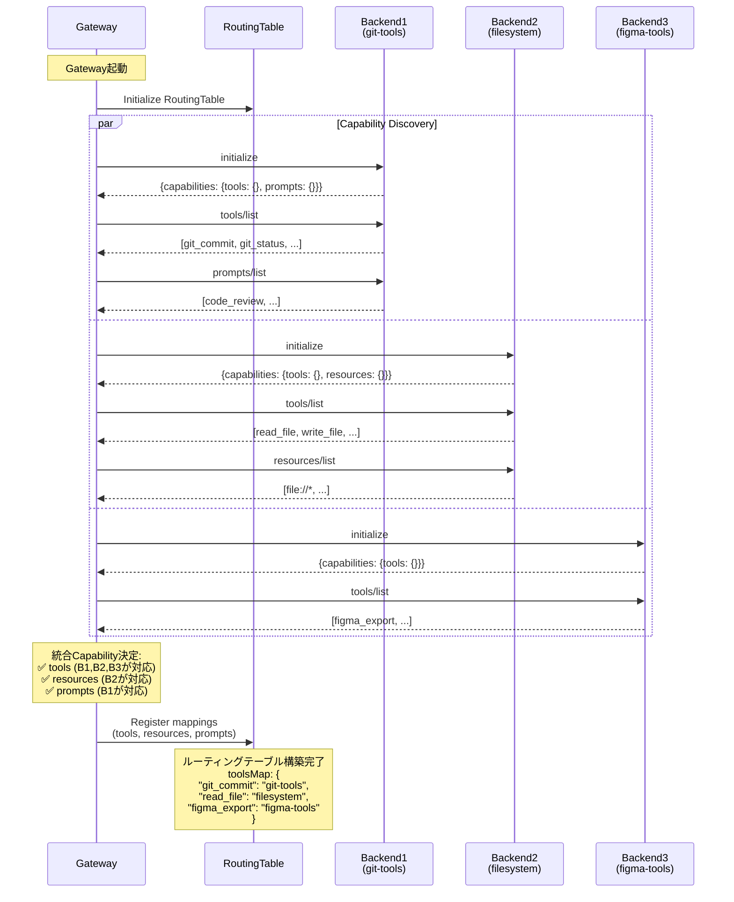
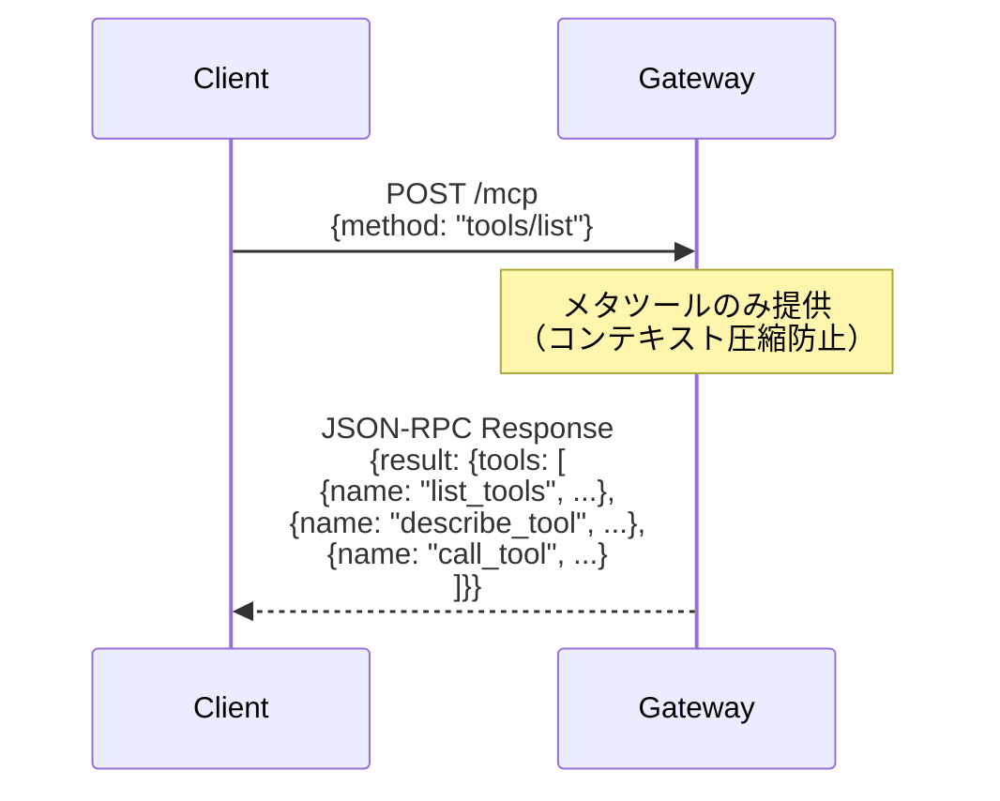
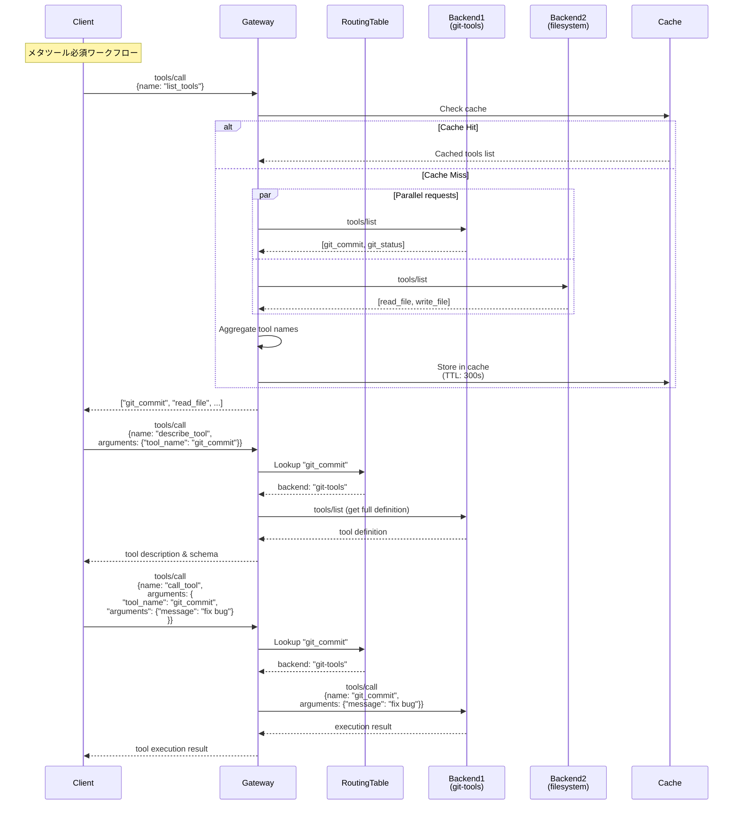
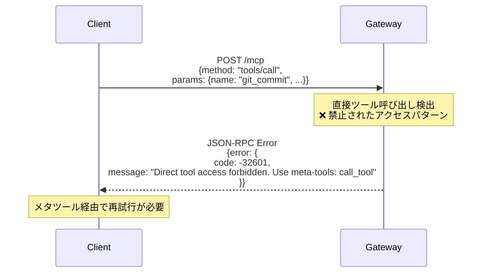
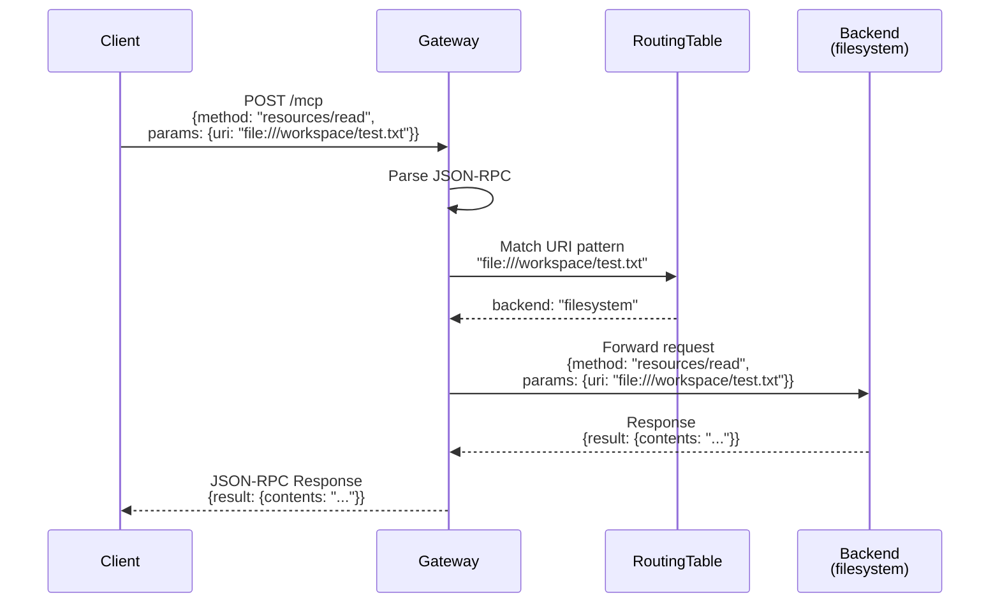
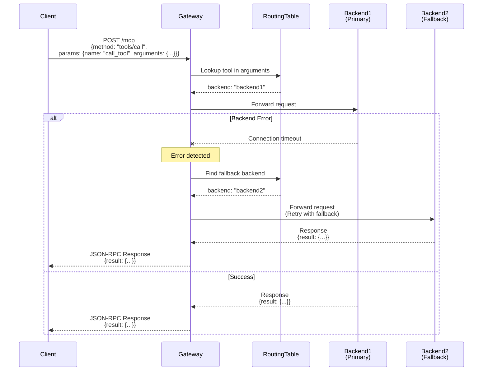
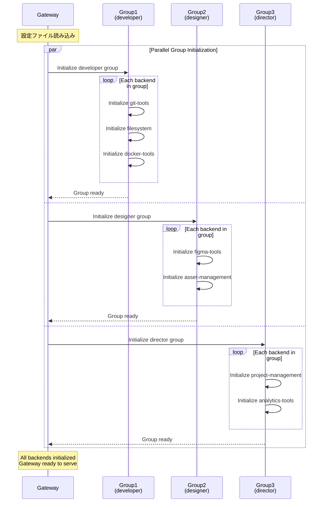
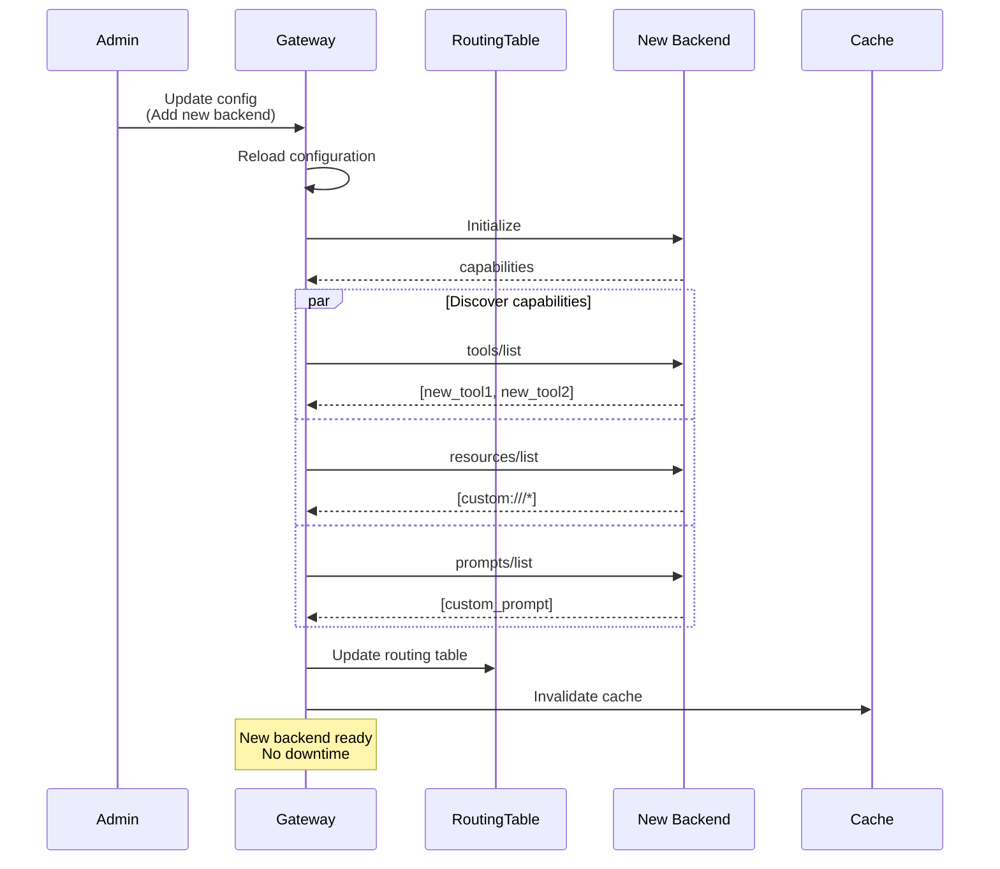

# MCP Server Gateway シーケンス図

## 1. 初期化シーケンス（起動時の能力ディスカバリー）

## 2. ツール一覧取得のシーケンス (tools/list) - メタツール提供

## 3. メタツール使用のシーケンス（完全なワークフロー）

## 4. 直接ツール呼び出し拒否のシーケンス

## 5. リソース読み取りのシーケンス (resources/read)

## 6. エラーハンドリングのシーケンス

## 7. 並行バックエンド初期化シーケンス

## 8. 動的バックエンド更新シーケンス

